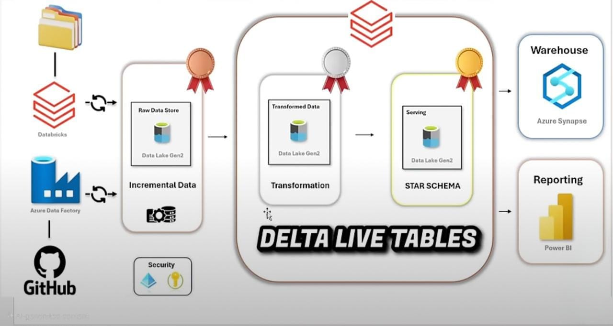

# Netflix Data Engineering Project

## 🚀 Project Overview

This project demonstrates an end-to-end **data engineering pipeline** using **Azure Data Factory (ADF)**, **Azure Data Lake Storage Gen2 (ADLS)**, and **Databricks (Delta Live Tables)**. The dataset used is Netflix content metadata sourced from a public GitHub repository. The pipeline is built in three layers: **Bronze, Silver, and Gold**, following the **Medallion architecture**.

---

## 🧱 Architecture & Tools

- **Azure Data Factory (ADF)**: Data ingestion and validation from GitHub  
- **Azure Data Lake Storage Gen2 (ADLS)**: Centralized storage for all layers  
- **Databricks**: Auto Loader, Delta Live Tables (DLT), workflows, and transformations  
- **Delta Lake**: Format for scalable and ACID-compliant tables  

---

## 🪪 Data Sources

- Dataset: Netflix Titles on GitHub  
- Files: `netflix_cast.csv`, `netflix_directors.csv`, `netflix_countries.csv`, `netflix_categories.csv`, `netflix_titles.csv`

---

## 🛠️ Step-by-Step Implementation

### 🔸 1. Data Ingestion Using ADF

- Used ADF pipelines to validate if files exist in GitHub  
- Iterated over files using **ForEach** activity  
- Copied files into **ADLS Bronze layer**:  
  - `/bronze/netflix_cast/`  
  - `/bronze/netflix_directors/`  
  - `/bronze/netflix_countries/`  
  - `/bronze/netflix_categories/`  
- Skipped `netflix_titles.csv` in ADF to demonstrate Databricks Auto Loader  

### 🔸 2. Bronze to Silver Using Databricks Workflows

- Created separate workflows for each entity  
- Used **widgets** to pass folder name as parameter  
- Read from Bronze, transformed, and wrote to Silver:  
  - `/silver/netflix_cast/`  
  - `/silver/netflix_directors/`  
  - `/silver/netflix_countries/`  
  - `/silver/netflix_categories/`  

### 🔸 3. Databricks Auto Loader for Netflix Titles

- Used Auto Loader to ingest `netflix_titles.csv` to Bronze  
- Created workflow that runs **only on Sundays** using weekday parameter  

---

## 🧪 Gold Layer with Delta Live Tables (DLT)

- Created Gold tables using Delta Live Tables (DLT)  
- Applied **quality validation rules** using `@dlt.expect_all` and `@dlt.expect_or_drop` decorators  
- Built structured gold-level tables for cast, directors, categories, countries, and titles  


## 📁 Folder Structure

```
netflix-data-engineering/
├── code/
│ ├── code_notebook/
│ └── netflix_project.dbc
├── dataset/
│ ├── netflix_cast.csv
│ ├── netflix_category.csv
│ ├── netflix_countries.csv
│ ├── netflix_directors.csv
│ └── netflix_titles.csv
├── Images/
│ ├── adf_workflow_to_bronze.jpeg
│ ├── bronze_to_silver_for4files.jpeg
│ ├── datalake_container.jpeg
│ ├── dlt_gold_layer.jpeg
│ ├── Project_Architecture.jpeg
│ └── workflow_of_netflix_titles.jpeg
└── README.md

```

## ✅ Features Implemented

- ✅ Validated GitHub file availability using ADF before ingestion
- ✅ Ingested multiple CSV files into ADLS Bronze layer using ADF ForEach
- ✅ Skipped one file (`netflix_titles.csv`) to demonstrate Databricks Auto Loader
- ✅ Used Databricks workflows with widgets to process Bronze → Silver layers
- ✅ Scheduled a conditional run of Auto Loader workflow only on Sundays
- ✅ Implemented Delta Live Tables (DLT) to build Gold layer with expectations
- ✅ Applied data quality rules using `@dlt.expect_all` and `@dlt.expect_or_drop`

## 🧭 **Project Architecture**




## 📈 Future Improvements

Add Power BI or Tableau dashboard on Gold layer

Implement Slowly Changing Dimension (SCD) logic for titles

Add column-level data quality checks (null %, data type expectations)

📬 Contact

For questions or collaboration, reach out at [bhagavathsaidarapureddy@gmail.com]

Built with 💻 Databricks, ADF, and Delta Lake
